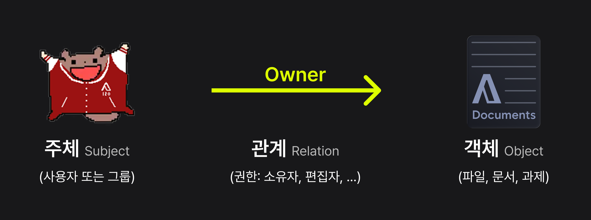
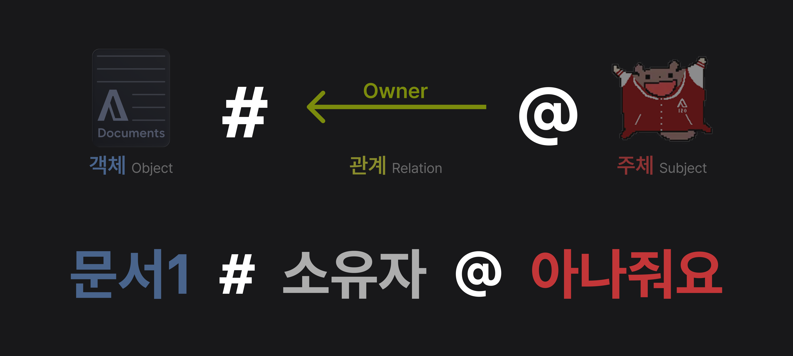

An Americano는 An Account에서 권한 관리를 쉽게 할 수 있도록 도와주는 관계 기반 권한 관리 시스템이에요.

## An Americano가 채택하는 모델
An Americano는 [Google의 Zanzibar 논문](https://research.google/pubs/zanzibar-googles-consistent-global-authorization-system/)을 참고하여 설계되었어요. 
Zanzibar 모델은 관계 기반 접근 제어 모델(RBAC, Relationship-Based Access Control Model)의 일종이에요. 

Zanzibar 모델은 객체(Object), 관계(Relationship), 주체(Subject)라는 세 가지 주요 개념을 중심으로 권한을 부여해요. 
### 권한의 3요소

- 객체(Object): 보호해야할 대상? 보호 당할 대상이에요. 예를 들어, 파일, 폴더, 과제, 게시물, 데이터베이스 레코드 등이 객체가 될 수 있어요.
- 주체(Subject): 객체에 접근하려는 사용자나 시스템이에요. 객체의 접근 권한을 가진 대상?이라고 이해하면 쉬워요. 예를 들어, 사용자 계정, 서비스 계정 등이 주체가 될 수 있어요.
- 관계(Relationship): 객체와 주체 간의 관계를 나타내요. 예를 들어, 소유자(owner), 편집자(editor), 뷰어(viewer) 등이 관계가 될 수 있어요.

### 관계 튜플
Zanzibar 모델에서는 객체, 관계, 주체 간의 관계를 '관계 튜플(Relationship Tuple)'이라는 형태로 표현해요. 
관계 튜플은 다음과 같은 형식을 가져요: 

예를 들어, 'file1'의 'owner'가 '아나줘요'인 경우, 다음과 같은 관계 튜플로 표현할 수 있어요: 
`file1#owner@아나줘요`

## An Americano가 이를 구현한 방식
사실 An Americano는 Zanzibar 모델을 완벽하게 구현하지는 않았어요. 
An Account의 빠른 출시를 위하여 현재는 일반적인 RDBMS를 사용하여 관계 튜플을 저장하고 관리하고 있어요. 
하지만 An Americano는 Zanzibar 모델의 핵심 개념을 따르고 있어요. 
따라서 An Americano를 사용하면 객체, 관계, 주체 간의 복잡한 권한 구조를 효과적으로 관리할 수 있어요. 
향후 An Americano는 Zanzibar 모델을 더욱 충실히 구현할 예정이에요.