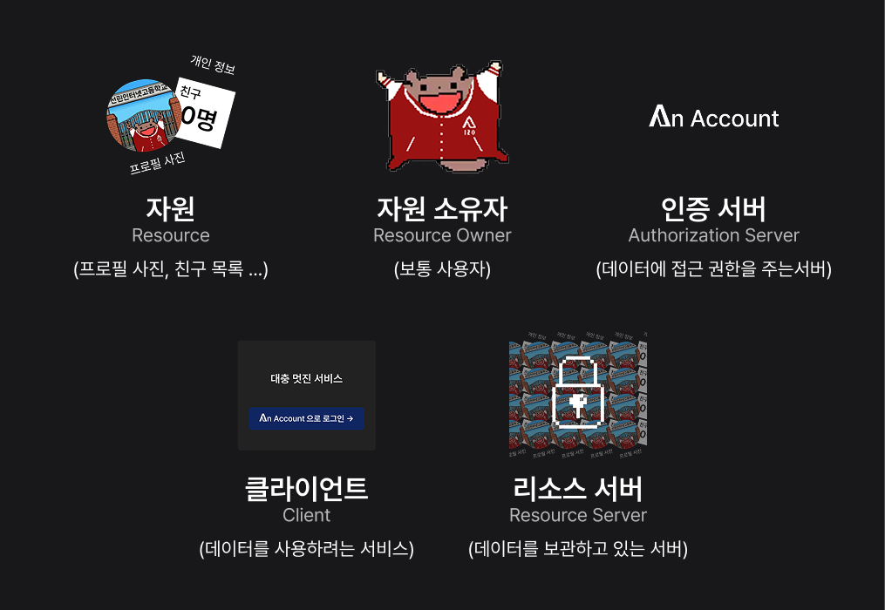
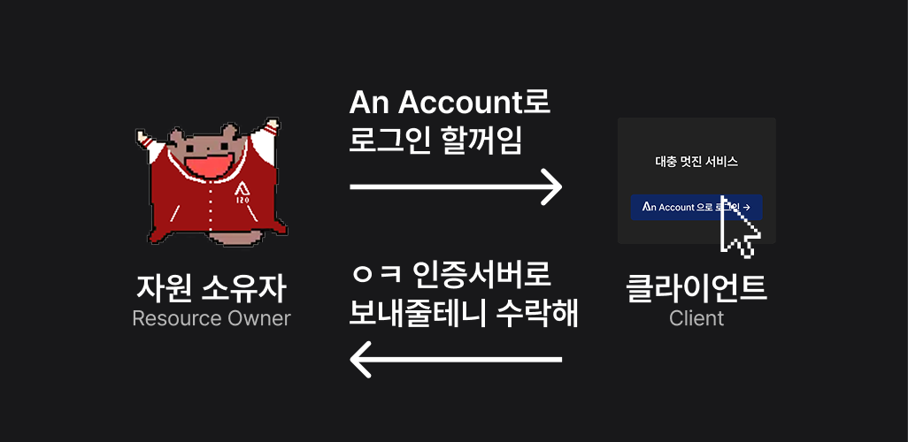
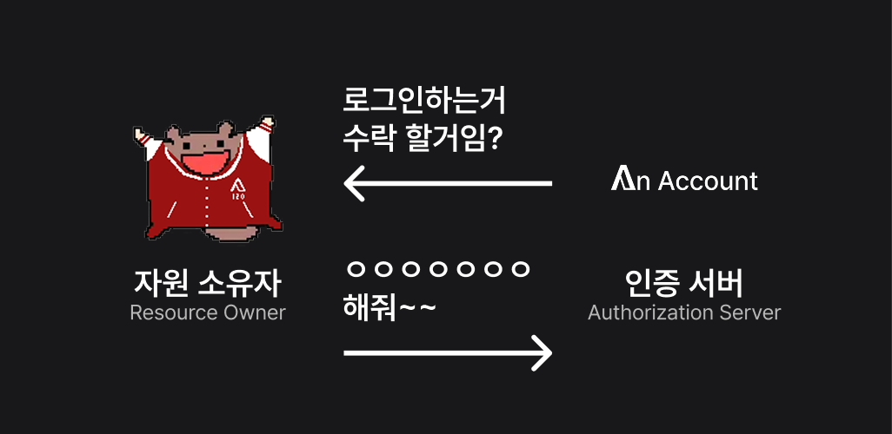
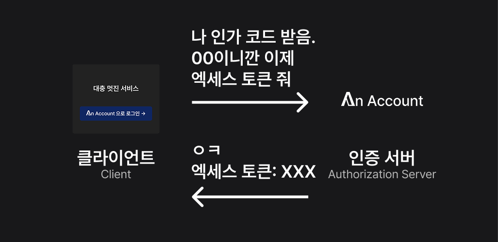
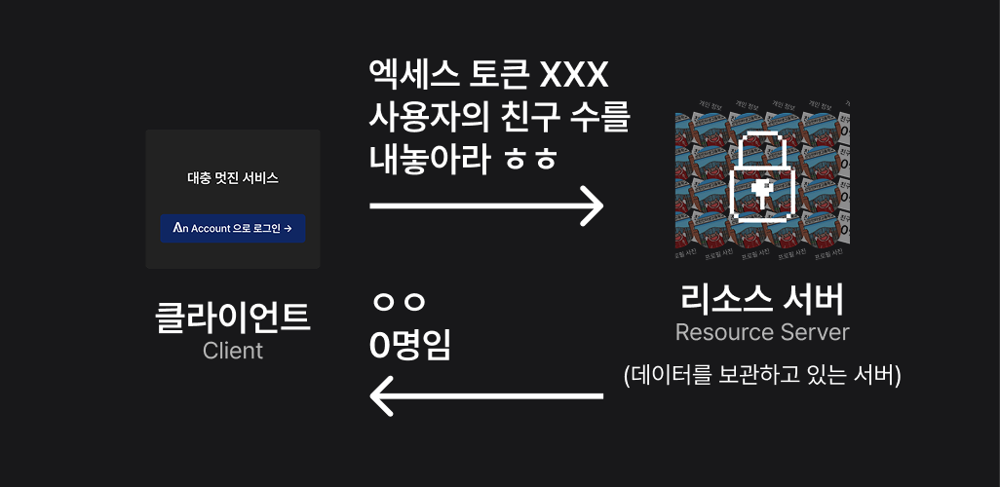

OAuth 2.0이란 서비스가 사용자의 비밀번호를 직접 다루지 않고도, 사용자가 허용한 범위 내에서 사용자에 대한 정보를 접근하거나 수정할 수 있는 표준 규격이에요.

## OAuth 2.0의 주요 개념

- 자원(Resource): 사용자의 프로필 사진이나 친구 목록과 같은 데이터에요.
- **자원 소유자(Resource Owner)**: 일반적으로 사용자를 칭하며, 앞서 언급한 자원을 소유하고 있는 주체를 의미해요. 이 문서에서는 편의를 위하여 '사용자'라고 칭할게요.
- **클라이언트(Client)**: 'OOO으로 로그인하기'와 같이 사용자의 데이터를 사용하려는 서비스를 뜻해요.
- **리소스 서버(Resource Server)**: 자원을 실질적으로 가지고 있는 서버를 뜻해요. (보통 서버를 나누어 놓기 때문에 리소스 서버와 권한 서버가 분리되어 있어요.)
- **인증 서버(Authorization Server)**: 클라이언트에게 사용자의 데이터에 접근할 수 있는 액세스 토큰을 발급해주는 서버를 의미해요.
- 액세스 토큰(Access Token): 클라이언트가 리소스 서버에서 사용자의 데이터에 접근할 수 있도록 허용하는 일종의 '열쇠'에요.

## OAuth 2.0의 작동 방식
### 자원 소유지와 클라이언트 간의 상호작용

먼저 사용자가 클라이언트(서비스)에 인증 서버로 로그인 할 것을 요청해요. 그런 요청을 받은 클라이언트는 사용자에게 인증 서버로 이동할 수 있는 링크를 제공해요. 그러면 사용자는 그 링크에 접속하여 인증 서버로 이동하게 돼요. (보통 직접 클릭이 아니라 'OOO으로 로그인'을 누르면 바로 이동하게 개발하는 것을 권장해요) 

**중요** - 클라이언트는 사용자에게 인증 서버로 이동할 수 있는 링크를 제공할 때, **자신이 어떤 권한을 요청하는지(예: 프로필 정보 접근, 친구 목록 접근 등)도 포함된 링크**를 제공해요.

### 클라이언트와 인증 서버 간의 상호작용

그렇게 이동한 인증 서버에서는 클라이언트가 사용자에게 요청한 권한을 허용할지 여부를 묻는 화면을 보여줘요. 사용자가 허용을 누르면 인증 서버는 클라이언트에게 '인가 코드(Authorization Code)'라는 걸 발급해줘요. (인가 코드는 일종의 '임시 코드'라고 생각하면 돼요) 

### 인증 서버와 클라이언트 간의 상호작용

그 후, 클라이언트는 사용자가 인증 서버로부터 받은 인가 코드를 가지고 인증 서버에다가 '액세스 토큰'을 요청해요. 그러면 인증 서버는 클라이언트에게 액세스 토큰을 발급해줘요. (당연히 인가 코드가 유효해야지만 발급해줘요) 

### 클라이언트와 리소스 서버 간의 상호작용

이제 클라이언트는 엑세스 토큰을 가졌으니 리소스 서버에다가 요청한 권한에 한에서 원하는 사용자 데이터를 요청할 수 있어요. 리소스 서버는 엑세스 코드를 바탕으로 클라이언트가 요청한 권한이 유효한지 검증한 후, 유효하다면 사용자 데이터를 클라이언트에게 전달해준답니다!

## 엑세스 토큰과 갱신 토큰
사실 엑세스 토큰은 유효 기간이 정해져 있어요. 그래서 엑세스 토큰이 만료되면 클라이언트는 다시 인증 서버에다가 엑세스 토큰을 요청해야 해요. 그런데 매번 사용자가 'OOO으로 로그인'을 눌러서 인증 서버로 이동하는 건 번거롭겠죠? 그래서 OAuth 2.0에서는 '갱신 토큰(Refresh Token)'이라는 개념을 도입했어요.  
갱신 토큰은 인증 서버가 엑세스 토큰을 줄때 같이 끼워줘요(이때 엑세스 토큰이 언제 만료되는지도 같이 알려줘요). 클라이언트는 엑세스 토큰이 만료되었을 때, 갱신 토큰을 가지고 인증 서버에다가 새로운 엑세스 토큰을 요청할 수 있어요. 이 과정에서는 사용자가 개입하지 않아도 되기 때문에 우리가 귀찮아질일이 없어요! 혁신이죠잉?

## 같이 보기
- [OAuth 2.0 공식 문서 (RFC 6749)](https://datatracker.ietf.org/doc/html/rfc6749)
- [OpenID Connect란? (OIDC)](./oidc.mdx)

## 참고 자료
[1] D. Hardt, Ed., <i>[RFC 6749 - The OAuth 2.0 Authorization Framework](https://datatracker.ietf.org/doc/html/rfc6749)</i>, October 2012. (Accessed at Jan 18, 2026)